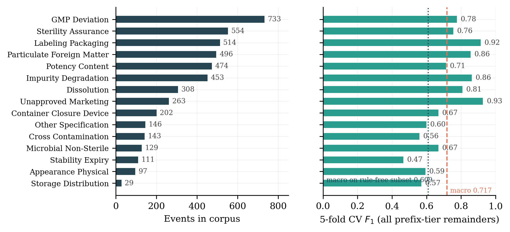
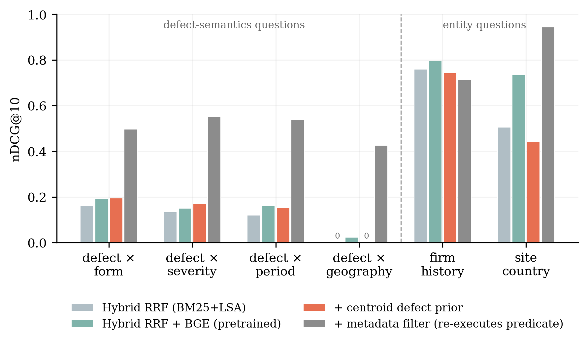
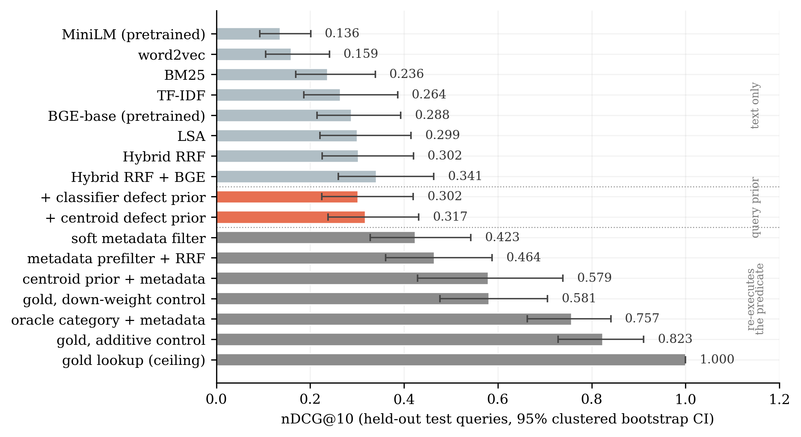

# When the Benchmark Answers Itself: Predicate-Defined Relevance and the Limits of Query Understanding in Pharmaceutical Quality-Event Retrieval

**Phani Kumar Balagam** Independent Researcher, United States ORCID
[0009-0007-6762-399X](https://orcid.org/0009-0007-6762-399X) · <balagam.phani@gmail.com>
· <https://github.com/phanibalagam>

Every number in this manuscript is produced by the scripts in `scripts/`
from the public data described in Section 3 and read from the JSON files in `results/`;
`scripts/08_verify_manuscript.py` re-checks each one against the result files and fails
on any disagreement.

## Disclaimer

This work was carried out independently, on personal time and equipment, and is not
connected to the author's employment. The views expressed are the author's own and do
not represent the views, positions or policies of any current, former or future employer
or client. No proprietary, confidential or internal data of any organization was used.
All data is public: the openFDA drug enforcement bulk export (US federal public domain,
export date 2026-08-27), and two pretrained sentence encoders downloaded from their
public repositories with their commit hashes recorded.

---

## Abstract

QUEST-QI is a benchmark for evidence retrieval over pharmaceutical quality events, and
to the author's knowledge the first public one in this domain: 171 questions from six
templates, with gold sets defined by executable predicates over structured fields. Its
baselines point in two directions. Eight retrievers span 0.136--0.341 nDCG@10; the best
of them scores 0.024 on the question family whose defect semantics no document states in
words, a pretrained encoder is statistically indistinguishable from corpus-trained
fusion, and the micro and macro aggregates disagree on which leads. The only
query-understanding component that infers its slot rather than reading it off recovers
+0.014 nDCG@10, a null at this sample size. The apparently stronger result is not a
retrieval result. A filter over the metadata a question names reaches 0.579, but it
re-executes the gold predicate: a control that adds a constant to every gold document,
over the same 300-document pool, reaches 0.823. The configuration recovers about half of
what that control is worth, and none of that half is retrieval. The point generalizes.
Any benchmark whose relevance is defined by an executable predicate rewards systems for
reconstructing it, and how much can be measured.

---

## 1 Introduction

A pharmaceutical quality investigation begins with a question about precedent. An
investigator holding a new deviation asks whether the same failure mode has been seen
before in the same dosage form, whether it has ever been classified as a serious hazard,
whether it clusters in a particular period or manufacturing geography, and what the same
firm has on record. The answers shape root-cause hypotheses, CAPA scope and
effectiveness-check design, and they must be traceable to source records because a
regulator will ask where each statement came from.

Retrieval-augmented generation [@lewis2020rag] is the obvious architecture, and the
obvious build is to embed the records, retrieve the nearest neighbors of the question,
and let a language model write the answer with citations [@gao2023alce]. We find that
this fails on precisely the questions investigators ask. A question about sterility
assurance in injectables retrieves records about sterility assurance in tablets; a
question about events outside the United States retrieves nothing relevant at all,
because no record says "outside the United States".

That much is a clean empirical finding. The rest of this paper is about what we could
not then demonstrate. The natural next step is to represent the question's structure,
parsing out the defect mode, the severity class, the period and the geography, and use
it to rank. Doing so raises nDCG@10 from 0.302 to 0.579. But that number is not a
retrieval result. Our structured filter compares the same fields, with the same regular
expressions, that the benchmark used to define which documents are relevant; the filter
*is* the relevance function. We size the problem with controls that do no query
understanding at all and simply score documents by gold membership: additively over our
300-document candidate pool such a control reaches
0.823, and ranking the gold set first reaches 1.000. Our best configuration
recovers about half of the first of those. When we strip out
everything that re-executes the predicate, the remainder, an unsupervised
defect-category prior, is worth +0.014 nDCG@10, with a confidence interval spanning
zero. That remainder is an upper bound rather than a clean measurement: the prior
matches against the same stored `defect_category` field the gold rule tests, so even it
is not fully independent of the predicate (Section 5.3).

We report this because the failure mode generalizes. Predicate-defined relevance is
attractive for building benchmarks without an annotation budget, and this paper is a
worked example of how it silently converts a retrieval evaluation into a test of
predicate reconstruction.

**Contributions.**

1. **QUEST-QI**: 4,652 recall events from the openFDA drug enforcement export, a
   15-class defect taxonomy, and 171 investigator-style questions generated
   automatically from six templates whose slot fillers yield 15 distinct question
   stems, with gold evidence sets defined by executable predicates over structured
   fields, split into
   dev (52) and test (119). The questions are not human-written and the gold sets are
   not adjudicated; Section 7 states what that costs.
2. **A distantly-supervised defect taxonomy** labeling 96.1% of events from
   canonical phrases in the FDA reason-for-recall field, with a classifier for the
   free-text tail cross-validated at 0.717 macro F1 overall and 0.609 on the
   rule-free subset that resembles the tail it is actually applied to.
3. **A diagnosis** of where text-only retrieval fails, tested against a pretrained
   encoder rather than asserted: the best text-only system answers entity questions
   at 0.796 nDCG@10 and defect-semantics questions at 0.151–0.193, falling to 0.024
   when the question constrains geography. Adding BGE to the fusion moves that
   family from 0.000 to 0.024, which is to say nowhere. Corpus-trained and pretrained
   representations are indistinguishable overall, and which one leads depends on
   whether the aggregate is taken over queries or over families.
4. **An inconclusive null and its measurement**: the query-understanding component
   that infers its slot from the question recovers +0.014 nDCG@10 (CI [−0.005,
   0.033]); the configuration that reads slots off the question recovers +0.277,
   which is about half of what a gold-membership control over the same candidate
   pool is worth, together with the pool-size and scoring-mechanism sensitivities of
   that fraction.

---

## 2 Related work

**Retrieval-augmented generation and its evaluation.** RAG couples a retriever to a
generator so that answers can be attributed to non-parametric memory [@lewis2020rag;
@gao2023ragsurvey]. Evaluation has followed two lines. One measures attribution
directly, asking whether each generated statement is supported by the cited passage
[@rashkin2021attribution; @bohnet2022aqa; @gao2023alce; @min2023factscore]. The other
automates end-to-end judgment with a second language model [@es2023ragas;
@saadfalcon2023ares; @zheng2023llmjudge]. Both lines presuppose that the retrieved
passages are the right ones; surveys of hallucination [@ji2022hallucination] and of
trustworthy RAG [@ni2025trustworthyrag] identify retrieval failure as an upstream cause
of unsupported generation. This paper evaluates only the retrieval stage, and reports
that in this domain it is the binding constraint.

**Where the retrieval literature places the difficulty.** Benchmarks such as BEIR
[@thakur2021beir] and studies of RAG robustness [@chen2023benchmarkingrag] treat the
retriever as the component to improve, and the dominant response has been better
document representations: dense passage retrieval [@karpukhin2020dpr], contrastive
pre-training [@izacard2021contriever; @wang2022e5] and the benchmarks that rank them
[@muennighoff2022mteb]. A smaller line rewrites the query instead, generating a
hypothetical answer to retrieve against [@gao2022hyde] or letting the model decide when
and what to retrieve [@asai2023selfrag]. Our diagnosis motivates the second line. On
this corpus the spread across document representations is
0.205 nDCG@10 across eight systems, and the pretrained retrieval encoder among them is
statistically indistinguishable from corpus-trained fusion here, while giving a system
the query's defect category is worth 0.107 on top of the corpus-trained fusion, and
0.069 more than the strongest system in that spread reaches on its own — an oracle over
one component of the gold predicate, not an obtainable signal (Section 5.4). But our attempt to exploit that
asymmetry produced a null, and the apparent success we first measured was an artifact of
benchmark construction. Position effects in long contexts [@liu2023lostinmiddle] are
downstream of everything here.

**Benchmark construction and what a test collection measures.** That test collections
encode biases which flatter some systems over others is an old and well-established
result, and our finding is a special case of it rather than a new phenomenon. Zobel
showed that pooled collections are incomplete in ways that systematically disadvantage
systems absent from the pool [@zobel1998reliable], and Buckley and Voorhees quantified
how incompleteness changes measured ordering [@buckley2004incomplete]; Buckley et al.
named the limits of pooling for large collections directly [@buckley2007bias]. Sanderson
surveys the whole test-collection paradigm and the assumptions it rests on
[@sanderson2010testcollections], and Fuhr catalogued the evaluation errors that follow
when those properties are ignored [@fuhr2017mistakes].

Two strands of that literature bear directly on what follows. The first asks how much of
a measured score is a property of the judgments rather than of the systems. Voorhees
showed that relative system ordering survives substantial disagreement between assessors
even though absolute scores move [@voorhees2000variations]; Scholer et al. turned
assessor consistency into a measure of collection quality [@scholer2011consistency];
Roitero et al. asked how many judgments a collection needs before its comparisons have
statistical power [@roitero2023crowdpower]; Sakai et al. examined how the order in which
pooled documents are presented for assessment changes the resulting collection
[@sakai2022pooling]; and Arabzadeh et al. showed that sparse, shallow pools misrank
modern systems [@arabzadeh2022shallow]. Ferro and Sanderson examine the significance
tests that turn those scores into claims [@ferro2022testatest]. The second strand is
infrastructure: `ir_datasets` [@macavaney2021irdatasets] and the Information Retrieval
Experiment Platform [@frobe2023platform] exist so that a released collection can be run
against by someone other than its author, which is the condition under which a
construction artifact gets found at all.

**Collections built without human judgments, and the circularity that follows.**
Automatically generated collections trade annotation cost for exactly the risk above.
Azzopardi and de Rijke showed that simulated known-item queries carry a bias determined
by the generation procedure [@azzopardi2007simulated]; pseudo test collections built from
anchor text or from microblog structure inherit the biases of the signal used to build
them [@asadi2011pseudo; @berendsen2013pseudo], and weak supervision derived from an
existing ranker teaches a model that ranker's behavior [@dehghani2017weak]. Dietz et al.
survey the general case of human-optional collections [@dietz2020humansoptional], and
Rahmani et al. examine the same question for collections generated by language models
[@rahmani2024synthetic].

The current form of the question is whether a language model can produce the relevance
labels themselves. Faggioli et al. set out the positions [@faggioli2023perspectives];
MacAvaney and Soldaini estimate relevance from a single labeled example
[@macavaney2023oneshot]; Thomas et al. report that model judgments track searcher
preferences [@thomas2024preferences]; Upadhyay et al. study the behavior of one such
assessor at scale [@upadhyay2025umbrela]; Arabzadeh and Clarke measure how much the
resulting labels move with the prompt [@arabzadeh2025prompt]; Sakai et al. compare
open-source model assessment against highly reliable manual assessment
[@sakai2025opensource]; Meng et al. build query performance prediction on model-generated
judgments [@meng2025qpp]; Turkmen et al. construct a test collection generated by
language models outright [@turkmen2026gentrec]; and Soboroff argues the practice should
stop [@soboroff2025dontuse]. The worry animating that debate is structural rather than
empirical: where the judge and the system under test draw on the same model, a collection
can reward agreement with the judge rather than retrieval, and no score computed on that
collection can separate the two.

**Our case is the same shape with a different judge.** Nothing in this paper concerns
language-model assessors. But a relevance rule that is an executable predicate over
structured fields is a judge of exactly that kind: it is a procedure, it is available to
the system at query time in the form of the metadata it tests, and a system that
re-executes it scores well without retrieving. The asymmetry is that a predicate is
legible in a way a model is not, so the reward for reconstructing it can be measured
rather than argued about. The parallel outside IR is annotation artifacts: models reach
high accuracy on NLI and fact-verification benchmarks by exploiting regularities
introduced during dataset construction rather than by performing the task
[@gururangan2018artifacts; @schuster2019fever], which Geirhos et al. place in the general
category of shortcut learning [@geirhos2020shortcut].

What we add is not the observation but a measurement recipe. Where the relevance rule is
an executable predicate, the rule can itself be run as a ranking signal, and doing so
turns an abstract worry into a number on the same scale as the leaderboard. Our
contribution is that this control needs two choices stated together, not one: how the
gold signal enters the score, and what candidate set it can reach. Getting either wrong
moves the number by more than any system in our Table 2 (Section 5.1), and the second
choice is the one the literature above does not force an author to declare.

**Domain collections and the relevance rules they use.** Specialist domains have built
their own collections, and the rule each one uses to declare a document relevant is the
part worth comparing. NFCorpus pairs consumer health questions with linked medical
literature [@boteva2016nfcorpus]; BioASQ draws its relevance from expert-curated
biomedical questions and answers [@tsatsaronis2015bioasq]; TREC-COVID assembled a
pandemic collection under the standard pooled-assessment protocol
[@voorhees2020treccovid]. Two are closer to our case than those. DBpedia-Entity v2
defines relevance for entity search over a structured knowledge base
[@hasibi2017dbpedia], where what makes an entity relevant is partly a property of fields
rather than of prose; and Shao et al. study relevance judgments in legal case retrieval
[@shao2023legal], a professional domain in which the criterion is closer to a rule than
to a topical impression. Neither builds its gold sets by executing a predicate, which is
the specific move this paper measures.

**Domain applications.** Language models encode substantial clinical knowledge
[@singhal2022clinicalknowledge], but recall records are operational documents rather
than textbook knowledge, and a corpus that extends to 2026 sits at or beyond current
models' knowledge horizon. To our knowledge no public benchmark exists for retrieval over pharmaceutical
quality and manufacturing records; the openFDA enforcement data [@openfda_enforcement]
has been used for epidemiological description rather than as a retrieval corpus.

---

## 3 QUEST-QI

### 3.1 Corpus

We use the official openFDA drug enforcement bulk export (public domain, export date
2026-08-27), containing 17,899 records. A record is a product line; a recall *event* can
span hundreds of product lines sharing one firm, one reason for recall and one
classification. An investigator reasons about events, so we aggregate by `event_id`,
which also removes duplication that would otherwise dominate every metric, since one
event in this export spans 470 records.

The corpus holds **4,652 events** from 1,655 firms in 24 countries, spanning
2012–2026 (mean 3.85 records per event, median 1, max 470). By classification:
2,911 Class II, 1,142 Class III, 598 Class I, 1 not yet classified. Each event
becomes one retrieval document containing firm, location, classification, status,
initiation and report dates, the reason-for-recall text, up to eight distinct product
presentations, distribution pattern and notification mode; documents average 117 words
(median 93, p95 263).

### 3.2 A defect taxonomy from canonical phrases

The FDA reason-for-recall field usually opens with a canonical defect phrase terminated
by a delimiter, as in "CGMP Deviations:", "Lack of Assurance of Sterility;" or "Labeling
- ...". We exploit this in three tiers. **Prefix tier**: the leading phrase is matched
against an ordered rule set of 15 categories (3,615 events). **Short tier**: the reason
has no delimiter but is short enough (≤60 characters) to be a canonical phrase itself,
and matches the same rules (855 events). **Classifier tier**: free-text narratives,
labeled by a TF-IDF logistic regression (182 events, 3.9%).

Rules cover **96.1%** of the corpus. The classifier trains *only* on prefix-tier events
and *only* on the text following the canonical phrase (3,559 examples), so the seed
evidence is never a feature. Five-fold cross-validation gives **0.717 macro F1** and
0.783 micro F1, but that figure flatters the tail. 64.4% of those remainders still
contain a phrase that some rule matches, and 34.1% still echo the rule that produced
their own label. Restricted to the 1,266 remainders where no rule fires, which is the
population the classifier actually faces, macro F1 is **0.609** (micro 0.728). We treat
the rule-free figure as the estimate that matches deployment. Figure 1 shows the
category distribution alongside the per-category scores.



*Figure 1: The 15-category defect taxonomy. Left, events per category. Right,
five-fold cross-validated F1 on the phrase-stripped task; the dashed line is overall
macro F1 (0.717), which overstates performance on the free-text tail by about 0.11.*

Well-separated categories are unapproved marketing (0.93), labeling and packaging (0.92)
and impurity/degradation (0.86). Weak ones are stability/expiry (0.47) and
cross-contamination (0.56), both sharing vocabulary with neighbors.

### 3.3 Benchmark construction

Each query pairs a natural-language question with a structured predicate; the gold
evidence set is every corpus event satisfying that predicate. This removes human
relevance judgment from the benchmark and makes it reproducible from the corpus alone.
Table 1 gives the six families with an example of each; Section 5.4 shows what the
arrangement costs.

The questions are **generated, not written**. One template per family is instantiated
with slot fillers drawn from the taxonomy, the severity classes, the dosage-form
vocabulary, the firm list and the period grid. The 171 questions are all distinct as
strings, but they reduce to 15 distinct 45-character stems, and within a family the
variation is confined to the slots. Two consequences follow and we do not hide either.
Lexical diversity is far below what an investigator population would produce, so the
absolute levels in Table 2 should not be read as an estimate of live performance. And
because a template pairs one phrasing with one predicate, a system that learned the
template-to-predicate map would score well without understanding anything; Section 5.4
is in part a measurement of how much of that map our own systems recovered. No human
adjudicated any query--document pair. Section 7 records this as the benchmark's
principal limitation and states what an adjudicated version would require.

| Family | Predicate | Example question |
|---|---|---|
| A | defect × dosage form | *Find previous recall events for sterile injectable products where sterility of the finished product could not be assured.* |
| B | defect × severity class | *Which recalls with the most serious health consequences (Class I) were driven by a situation where the amount of active ingredient was outside the labeled strength?* |
| C | firm | *Summarize every recall event on record for the firm Amneal Pharmaceuticals, LLC.* |
| D | defect × period | *Between 2019 and 2021, which recalls happened because the batch did not meet its release testing profile for drug release rate?* |
| E | defect × non-US geography | *Find recalls from firms located outside the United States where a degradant or impurity exceeded its acceptance criterion.* |
| F | site country | *What recall events involve product manufactured or recalled from a site in Spain?* |

*Table 1: The six question families, their predicates and one generated example each.
Every question in the benchmark is an instantiation of one of these six templates; the
15 distinct question stems are the slot fillers applied to them.*

Questions use investigator phrasing and deliberately avoid the FDA canonical phrase, so
no system can succeed by string-matching a category name: the STERILITY_ASSURANCE
category is asked as "sterility of the finished product could not be assured", never as
"Lack of Assurance of Sterility".

Family D's predicate uses the recall *initiation* year rather than the FDA report year,
which differ for 14.4% of events. The choice aligns the predicate with the field the
metadata filter reads, so that the two are not silently measuring different things. It
gives text-only systems no lexical advantage: both dates are written into the document
text, but as unsegmented eight-digit tokens (`20190315`), which the tokeniser keeps
whole, so neither date is matchable against "Between 2019 and 2021" by any of our
lexical channels.

We keep queries whose gold set holds 3–75 events and sample up to 45 per family with a
fixed seed, giving **171 queries** (3,646 query–event gold pairs over 2,185 distinct
events; gold set size median 15, mean 21.3, max 71). A stratified 30/70 split yields
**52 dev and 119 test** queries. λ, the only swept hyper-parameter, is chosen on dev;
every headline number is reported on test.

---

## 4 Systems

All systems index the 4,652 event documents and rank on one CPU core, with no external
API and no data leaving the boundary. That is a design choice, adopted because it is what
an on-premise deployment in a regulated organization would look like, and not a
restriction we were operating under; we say so because the difference matters when
reading the Limitations. The pretrained encoders are the single exception: their weights
are downloaded once and then run locally, which is what such a deployment would also do.

**Text channels.** *BM25* [@robertson2009bm25]. *TF-IDF* cosine over 1–2-grams with
sublinear term frequency. *LSA*, truncated SVD to 300 dimensions over the TF-IDF matrix.
*word2vec*, skip-gram trained on the corpus (200 dimensions, window 8, 8 epochs),
documents as IDF-weighted mean token vectors.

**Pretrained encoders.** *BGE*, `BAAI/bge-base-en-v1.5` (768 dimensions, 512-token
window), encoded with the asymmetric query instruction it was trained with; *MiniLM*,
`all-MiniLM-L6-v2` (384 dimensions) [@reimers2019sbert]. Both are L2-normalized and
ranked by inner product. Model commit hashes are recorded in
`results/dense_manifest.json`, so "we used BGE" is a checkable statement rather than a
model name.

**Fusion.** *Hybrid RRF*, reciprocal rank fusion (k = 60) of BM25 and LSA. *Hybrid RRF +
BGE* additionally fuses the BGE ranking. Hybrid RRF, not the dense fusion, remains the
base that every system in Sections 5.3–5.5 is built on and contrasted against, because
it is the strongest configuration that needs no downloaded weights and so is the one a
reader can reproduce offline. Section 5.3 re-runs the headline contrast on the dense
fusion so that nothing turns on this choice.

**Defect-prior channel** adds one term to the fused score: a prior over the taxonomy,
inferred from the question, added to the RRF score of every candidate in the matching
category and weighted by λ.

- *Classifier prior*: the Section 3.2 classifier applied zero-shot to the
question. Deployable, but trained on recall narratives rather than questions.
- *Centroid prior*: cosine between the question's LSA vector and each category's
mean LSA vector, softmax-scaled. Deployable and needs no labeled question data.

Both priors match against the document's `defect_category` label, which is the same
field the gold predicate tests for families A, B, D and E. They differ from the metadata
channel in that the *query* side is inferred rather than read off the question,
imperfectly, at 31% and 58.3% top-1 accuracy, and the document side is a label derivable
from the document's own text. We describe them as inferring the slot, not as independent
of the predicate.

**Metadata channel** reads severity class, year range, country and dosage form from the
question by pattern and down-weights violating candidates by 0.5 (*soft metadata
filter*) or removes them before ranking (*metadata prefilter*). **This channel
re-executes the benchmark's gold predicate**; Section 5.4 treats it as a measurement of
circularity rather than as a system.

**Gold-membership lookup** down-weights every document outside the gold set by the same
factor. It is not a system; it is the control that bounds what the metadata channel can
be measuring.

λ is chosen per configuration on dev from {0, 0.25, 0.5, 1, 2, 4, 8, 16}; selected
values were 0.25 (classifier prior), 2 (centroid), 2 (oracle category), 4 (classifier +
metadata), 8 (centroid + metadata) and 4 (oracle + metadata). The additive gold control
of Section 5.4 has its constant chosen the same way, on dev, and lands on 4; its dev
curve is flat from λ = 4 upward (0.8489 at λ = 2, then 0.8519 at 4, 8 and 16), because
past that point it already ranks every gold document in the pool first. Other settings (the 0.5 down-weight, the centroid softmax
temperature of 8, the 300-document candidate pool, RRF k = 60, SVD dimension 300 and the
3–75 gold-size window) were fixed a priori and never swept; they are recorded in
`results/proposed_results.json` under `unswept_hyperparameters`. At the selected λ the
prior term can exceed the maximum achievable RRF score, so the constrained
configurations are better described as ranking by predicted category and tie-breaking by
text than as a balanced fusion.

**Statistics.** Queries built from the same defect category share most of their gold
events, so an i.i.d. bootstrap over queries understates variance. Headline confidence
intervals and all contrasts use a cluster bootstrap over 50 clusters: one per defect
category, plus one per query for the entity families, whose gold sets are near-disjoint
*within* the entity block. Clusters are gold-disjoint within each block, but 44.9% of
the gold events in entity clusters also appear in some defect cluster, so the two blocks
are not independent of each other and the intervals are not fully conservative. Note
also that the 84 defect-family test queries occupy only 15 clusters, so contrasts driven
by those families have an effective n nearer 15 than 119. Resamples are 2,000, drawn
once and reused for every statistic, so that two estimates of the same quantity cannot
differ by Monte-Carlo noise. Per-family intervals in the result files are i.i.d. over at
most 31 queries and should be read as indicative only. Contrasts against the text-only
baseline are Holm-corrected within each script's family of comparisons: seven in script
04 (every other system in Table 2 against Hybrid RRF) and eight in script 05 (the eight
systems under test; the classifier prior with metadata is one of them and appears
nowhere in the manuscript, but is kept in the family, which is conservative). The three
gold controls of Section 5.4 are contrasted and reported with raw p only. They are
diagnostics of the benchmark rather than candidate systems, so a multiple-comparison
family over systems is the wrong home for them; all three sit below the bootstrap's
resolution floor in any case, so this choice leaves every adjusted p in the manuscript
unchanged. The six channel ablations are reported as intervals without p-values and are
not corrected. Because the two-sided p is twice the smaller tail, 2,000 resamples cannot
resolve below 0.001; a reported 0.0 means p < 0.001 and we never claim more.

**What the bootstrap does and does not resample.** The clusters are over queries. The
corpus, the taxonomy, the templates and the predicates are held fixed in every resample,
so every interval in this paper is a statement about query sampling variability alone.
None of them carries uncertainty from the corpus draw, from the taxonomy's rule seeds,
from the classifier that labels the 3.9% free-text tail, or from the choice of template
phrasings. A different export of the same openFDA data, or a differently-worded template
set, could move these numbers by more than the intervals suggest, and nothing here
bounds by how much. Read the intervals as the narrowest of the uncertainties present,
not as the total.

---

## 5 Experiments

### 5.1 Text-only retrieval

| System | R@10 | R@50 | R@100 | P@10 | **nDCG@10 (micro)** | 95% CI (cluster) | nDCG@10 (macro) | MRR |
|---|---|---|---|---|---|---|---|---|
| MiniLM (pretrained) | 0.105 | 0.213 | 0.259 | 0.088 | 0.136 | [0.092, 0.201] | 0.124 | 0.256 |
| word2vec (corpus-trained) | 0.147 | 0.244 | 0.286 | 0.103 | 0.159 | [0.105, 0.241] | 0.119 | 0.245 |
| BM25 | 0.221 | 0.342 | 0.389 | 0.164 | 0.236 | [0.169, 0.339] | 0.200 | 0.333 |
| TF-IDF | 0.241 | 0.362 | 0.416 | 0.166 | 0.264 | [0.186, 0.386] | 0.249 | 0.364 |
| BGE-base (pretrained) | 0.239 | 0.380 | 0.436 | 0.201 | 0.288 | [0.215, 0.393] | 0.296 | 0.410 |
| LSA (corpus-trained) | 0.257 | 0.411 | 0.484 | 0.208 | 0.299 | [0.221, 0.415] | 0.257 | 0.412 |
| Hybrid RRF (BM25 + LSA) | 0.260 | 0.396 | 0.457 | 0.211 | 0.302 | [0.225, 0.420] | 0.280 | 0.410 |
| **Hybrid RRF + BGE** | **0.284** | **0.424** | **0.494** | **0.229** | **0.341** | [0.260, 0.463] | **0.343** | **0.500** |

*Table 2: Text-only retrieval, 119 held-out test queries. Micro is the mean over
queries; macro is the unweighted mean over the six question families. Intervals are
2,000-resample cluster bootstraps over 50 defect-category clusters, and are wide enough
that only the extremes of this table are separated. Hybrid RRF is the base
Sections 5.3–5.5 build on, for the reason given in Section 4; Hybrid RRF + BGE is the
strongest text-only system we have under both aggregates. Cells are the four-decimal
values in `results/retrieval_results.json` displayed to three; several sit exactly on a
half, where either rounding is correct and this table uses both, so read a third-decimal
difference of one unit as a display artifact rather than a result.*

Fusion beats BM25 alone (+0.066, CI [0.034, 0.106], Holm p = 0.0) and TF-IDF alone
(+0.039, CI [0.004, 0.072], Holm p = 0.099) and is indistinguishable from LSA alone
(+0.003, CI [−0.024, 0.031], Holm p = 1.0). Averaged word2vec trails everything (−0.143
against fusion), and MiniLM is worse still (fusion beats it by +0.167, CI [0.116,
0.244], Holm p = 0.0). A general-purpose symmetric encoder is the wrong tool here.

**Neither encoder family dominates, and the aggregate decides which one looks better.**
Under the micro-average BGE-base reaches 0.288 against 0.302 for BM25 + LSA fusion, a
difference of 0.015 with CI [−0.047, 0.076] and Holm p = 1.0. Under the macro-average
over families the ordering reverses: BGE 0.296 against 0.280. Both differences are
inside the interval, so the defensible statement is that the two are indistinguishable
on this corpus, not that either wins. The reversal is not noise about a single number,
it is a real difference in shape. The micro-average is dominated by the two largest
families, and almost all of corpus-trained fusion's advantage sits in one of them:
`C_firm_history`, where it reaches 0.759 against BGE's 0.658, on 31 of 119 test queries.
It also leads on `A_defect_form` (0.162 against 0.148, n = 31). BGE is ahead on the other
four families: B (n = 18), E (n = 10) and F (n = 4) are small, but D is mid-sized at
n = 25. A reader who
cares about defect-semantics questions should read the macro column; a reader
sampling queries in this benchmark's proportions should read the micro column. We report
both and claim neither as the headline.

What is not in dispute is complementarity: adding BGE to the fusion is worth +0.038, CI
[0.023, 0.057], Holm p = 0.0 under the micro-average — it is the only pretrained dense
channel added to a fusion here, so there is nothing to rank it against — and the dense
fusion is ahead under both aggregates (0.341 micro, 0.343 macro). Recall notices are short, templated regulatory prose whose discriminating
content is firm names, product presentations and defect phrases; a corpus-trained
representation captures that vocabulary directly, and a general web-and-QA encoder
contributes a different and partly disjoint set of hits rather than a uniformly better
one.

Indexing is cheap: under a second for BM25, a few seconds for LSA, tens of seconds for
word2vec, and about five minutes to encode the corpus once with BGE on CPU. Per-query
latency is in the low milliseconds on one CPU core once indexed; exact wall-clock
figures vary run to run and are recorded in `results/retrieval_results.json`.

The absolute numbers are low, which is the subject of the next section.

### 5.2 Where text-only retrieval fails



*Figure 2: nDCG@10 by question family, test split. Text-only fusion answers entity
questions and collapses on defect-semantics questions. The third bar re-executes the
gold predicate and is shown for scale, not as a system.*

Split by family, the aggregate hides two different regimes. On **entity questions**
(firm history and site country) the best text-only system reaches 0.796 and 0.735
nDCG@10, because the firm or country name is a rare string appearing verbatim in the
target documents. On the four **defect-semantics families** it reaches 0.193,
0.151, 0.161 and **0.024**.

The last is the clearest case, and it is the one we can now test rather than assert. No
document contains "outside the United States", so a question built on that constraint
retrieves almost nothing relevant. Every lexical channel scores exactly 0.000 on this
family; corpus-trained LSA reaches 0.013; **BGE, a pretrained retrieval encoder, reaches
0.009**, and the fusion that includes it reaches 0.024. Adding a strong pretrained
encoder moves this family from nothing to nothing.

The reason is not that the country is missing from the text. It is written down in every
document: each opens `Location: <city>, <state>, <country>`, and 4,462 documents contain
the string "United States". What no similarity channel can express is the *complement*
of that set. Encoding the documents better cannot help, because the operation the
question requires is set difference and the operation a similarity score performs is
not.

The spread across document representations here is 0.205 nDCG@10 (MiniLM to Hybrid RRF +
BGE), and most of it is crossed by corpus-trained channels alone; the pretrained encoder
buys the last 0.038. The foot of that spread is itself a
pretrained encoder; measuring instead from the weakest corpus-trained channel (word2vec,
0.159), corpus-trained channels still cross 0.143 of the 0.182 that remains above
word2vec, 79% rather than 81%, so the claim holds under either framing. Giving a system the query's true defect category is worth 0.107 on
top of the corpus-trained fusion, and 0.069 more than the strongest system in that spread
reaches on its own, for free — though "given" is the operative word: this is an oracle
over one component of the gold predicate, not an obtainable signal, and Section 5.4 is about
what that distinction costs. That asymmetry is what motivated the rest of this work.

Family sizes on the test split are uneven (A = 31, B = 18, C = 31, D = 25, E = 10, F =
4), so per-family cells carry wide uncertainty, and the pooled aggregate is a mixture
weighted by an arbitrary sampling cap. Per-family confidence intervals and the
macro-average across families are in `results/retrieval_results.json`.

### 5.3 Query understanding without the predicate

Figure 3 places every system in this paper on one axis, separating those that infer a
constraint from those that read one off the question.



*Figure 3: nDCG@10 on the held-out test split with 95% clustered bootstrap
intervals. Gray, text-only baselines; coral, query-understanding systems that infer the
defect category from the question rather than reading a constraint off it; dark gray,
configurations that read constraints off the question and so re-execute the gold
predicate directly. The coral systems are not predicate-free: they match against the
same stored category label the gold rule tests, with a noisy query side, so their gains
are upper bounds (Section 5.3).*

| System | R@10 | R@50 | P@10 | **nDCG@10** | MRR | Δ vs Hybrid RRF (Holm p) |
|---|---|---|---|---|---|---|
| Hybrid RRF (text only) | 0.260 | 0.396 | 0.211 | 0.302 | 0.410 | n/a |
| + classifier defect prior | 0.259 | 0.399 | 0.210 | 0.302 | 0.409 | −0.001 [−0.007, 0.005] (0.834) |
| + centroid defect prior | 0.265 | 0.448 | 0.226 | 0.317 | 0.425 | +0.014 [−0.005, 0.033] (0.304) |

*Table 3: Query-understanding systems that infer the defect category from the
question alone. Neither reaches significance.*

Table 3 reports both systems. Neither supports the component we set out to build.

**The supervised query classifier transfers poorly and dev selection all but switches it
off.** Applied to the questions it reaches 31% top-1 category accuracy against a 6.7%
chance rate, far above chance and far below usable. λ selected on dev is 0.25, the
smallest non-zero value on the grid, and the resulting system is indistinguishable from
the text-only baseline (−0.001, CI [−0.007, 0.005], Holm p = 0.834). A classifier
trained on FDA recall narratives does not transfer to investigator phrasing.

**The unsupervised centroid prior transfers better but does not pay off.** Matching the
question against category centroids in the corpus's own LSA space reaches 58.3% top-1
accuracy, nearly twice the classifier and with no labeled question data, and improves
recall@50 from 0.396 to 0.448. But on nDCG@10 it is worth +0.014, CI [−0.005, 0.033],
Holm p = 0.304. We cannot reject zero.

**This null is inconclusive, not a demonstration of no effect, and we do not have the
sample size to make it one.** The interval runs to +0.033 nDCG@10 at its upper end, an
11% relative gain over the 0.302 base, comparable to what adding BGE to the fusion buys
(+0.038) and half of what fusion over BM25 alone is worth (+0.066). Read as a pair of
one-sided tests, the data reject equivalence-to-zero only for margins wider than
0.033, so no equivalence claim at any margin a practitioner would care about is
available here. The clustered standard error implied by that interval is about 0.010
nDCG@10; holding the point estimate at +0.014, an interval excluding zero would need
roughly twice the query count of the current test split, and more than that after Holm
correction. A benchmark of this size cannot settle a +0.014 effect. What we can say is
that the centroid prior does not deliver the gain the Section 5.2 asymmetry suggested
was available, and that anyone claiming it does needs a larger evaluation than this
one.

**The null is not an artifact of a weak base.** The obvious objection to a null result
is that the retriever it sits on top of was too weak to show a gain. We re-ran both
priors on the Hybrid RRF + BGE fusion, with λ re-selected on dev. The centroid prior is
worth +0.020 nDCG@10, CI [0.0002, 0.041], p = 0.048 raw and 0.096 after Holm correction
within the pair; the classifier prior is worth +0.001, CI [−0.013, 0.015]. The point
estimate moves from +0.014 to +0.020 and the interval now barely excludes zero before
correction and includes it after. We do not read that as a positive result, and we would
not have reported it as one had the dense fusion been our base: it is the same small
effect, still not separable from zero at the correction the rest of the paper uses. What
it does rule out is the "your retriever was weak" reading, because a stronger base makes
the defect prior neither redundant nor decisive.

**Neither prior is fully independent of the predicate, which makes the null stronger.**
Both match the question's inferred category against each document's stored
`defect_category` field, the same field, read from the same file, that the gold rule
tests for families A, B, D and E. The query side is inferred rather than parsed, and
imperfectly (58.3% and 31% top-1), so these are not the metadata channel; but they are
soft, noisy partial gold membership rather than a predicate-free signal. This has two
consequences. For the 3.9% of events labeled by classifier rather than rule, the prior
and the gold set inherit the *same* model's errors, so the prior is right about them by
construction. And the +0.014 is therefore an upper bound on what a genuinely
predicate-independent query understanding component would deliver: the predicate-free
gain is at
most this, and plausibly less. On the four defect-semantics families we have no fully
predicate-independent query-understanding system at all; building one would require a
category signal derived at query time from document text rather than read from the
stored label.

This is the paper's central null, and it is an unresolved one rather than a demonstrated
absence. The diagnosis in Section 5.2 says the headroom is in query understanding. Our
best attempt at query understanding does not capture it, that attempt was already given a
partly circular advantage, and the benchmark is not large enough to distinguish "does not
help" from "helps by an amount we cannot see".

### 5.4 What the metadata channel actually measures

The obvious way to do better is to parse the severity class, period and geography out of
the question and filter on them. It works spectacularly and is not a retrieval result.

The soft metadata filter alone reaches 0.423, and a hard prefilter with no defect
prior reaches 0.464, against a text-only baseline of 0.302. Both figures name what
the filter does rather than what a retriever learns, which is the distinction the
rest of this section is about.

| Configuration | **nDCG@10** | Δ vs Hybrid RRF |
|---|---|---|
| Hybrid RRF (text only) | 0.302 | n/a |
| Soft metadata filter, no defect prior | 0.423 | +0.121 [0.074, 0.166] |
| Hard metadata prefilter + RRF, no defect prior | 0.464 | +0.162 [0.101, 0.221] |
| Centroid prior + metadata filter | 0.579 | +0.277 [0.145, 0.392] |
| Oracle defect category + metadata filter | 0.757 | +0.454 [0.340, 0.540] |
| *Control:* gold membership, down-weight form | 0.581 | +0.278 [0.220, 0.336] |
| *Control:* gold membership, additive form | 0.823 | +0.520 [0.430, 0.594] |
| *Ceiling:* gold ranked first | 1.000 | +0.698 [0.580, 0.775] |

*Table 4: The metadata channel against controls that do no query understanding at
all and score documents purely by gold membership. The two control forms differ in how
the gold signal enters the score and in whether the 300-document candidate pool is
reachable through it. The oracle row is not an independent rung of this ladder: on the
four families whose predicate is defect category × constraint it is numerically
identical to the additive control, per family, to every decimal place, because boosting
the true category and then penalizing constraint violations selects exactly the gold
set. It differs only on the two entity families, where no defect slot exists. The
identity is recorded in `results/proposed_results.json` under
`oracle_vs_gold_control_by_family`.*

The benchmark declares an event relevant when `classification == "Class I"`, when
`year_from <= init_year <= year_to`, when `country == "Spain"`, or when the product text
matches a dosage-form regex. The metadata filter tests the same fields with the same
comparisons and, for the dosage-form case, the identical regular expression. For family
F the filter's accept set *is* the gold set. The one imperfection is family E, where the
gold rule requires a non-empty country that is not the United States while the filter
only rejects the United States; exactly one corpus event has no country, so the
difference is numerically nil. So the question is not whether the metadata
configurations reconstruct the predicate, which they do by construction, but how much of
the available gain that reconstruction captures.

**The form of the control matters, and getting it wrong is easy.** Our first control
multiplied the score of every non-gold document by the same 0.5 the soft filter uses. It
scores 0.581, almost exactly the 0.579 of our best configuration, and we initially read
that as proof the configuration had saturated predicate reconstruction. That reading was
wrong. A multiplicative down-weight cannot promote a gold document the text channel
never surfaced, because zero times a half is zero; it is capped by the text retriever,
while the systems it is meant to bound add a constant and can lift documents with no
text score at all. Matched to that additive mechanism and the same 300-document
candidate pool, the same gold signal reaches **0.823**, and simply ranking the gold set
first reaches **1.000**.

Taking 0.823 as the denominator, the proposed configuration recovers 53% of what
predicate reconstruction is worth *within the 300-document pool* ((0.579 − 0.302) /
(0.823 − 0.302) = 0.532). Three qualifications have to travel with that number, and all
three matter.

**It is not precise.** The fraction is a ratio of two differences, each with a wide
interval. Resampling the ratio itself under the same cluster bootstrap gives 95% CI
**[0.31, 0.72]**. "Roughly half, between a third and three-quarters" is as much as the
data supports; we use 53% as shorthand and never as a point estimate.

**It is not mechanism-matched, by our own standard.** The proposed configuration adds
the prior and *then* applies the multiplicative slot penalty (`s += λ·prior; if
violated: s *= 0.5`), so it is additive *and* multiplicative, while the additive control
is additive only. The one pairing in this table whose system and control share a
mechanism exactly is the purely multiplicative soft filter against the purely
multiplicative down-weight control: (0.423 − 0.302)/(0.581 − 0.302) = **0.434**, CI
[0.29, 0.55]. That is the cleanest single statistic here, and it agrees with the
headline to within its interval.

**The middle row measures the candidate pool as much as the mechanism.** Beyond λ = 2
the additive control ranks every gold document *in the pool* above every non-gold one,
so its score is simply the pool's gold recall and the additive constant stops doing
work. `POOL = 300` was fixed a priori and never swept. Table 5 re-runs both the control
and the proposed system at each pool size, with λ re-selected on dev for each:

| Candidate pool | Matched control | Proposed | Fraction recovered |
|---|---|---|---|
| 100 | 0.741 | 0.535 | 0.53 |
| 300 (reported) | 0.823 | 0.579 | 0.53 |
| 600 | 0.894 | 0.600 | 0.50 |
| 1,000 | 0.934 | 0.605 | 0.48 |
| 2,000 | 0.977 | 0.612 | 0.46 |
| 4,652 (full corpus) | 1.000 | 0.628 | 0.47 |

*Table 5: The recovered fraction is stable at 0.46–0.53 when both sides see the
same pool, but the control's absolute score is not: it is the pool's gold recall and
rises to the ceiling as the pool grows.*

The fraction survives; the interpretation of the gap between 0.823 and 1.000 does not.
That gap is pool truncation rather than scoring mechanism: at full pool the
"mechanism-matched" control is the literal ceiling. We had presented the two rows as a
lesson about matching mechanisms; the fuller lesson is that a gold-membership control
measures the reachable candidate set as well as the scoring form, and that both must be
stated for the number to mean anything.

Three consequences follow.

First, the +0.277 for the metadata configuration is not evidence about query
understanding, and neither is the +0.121 from the constraint channel alone. A
conventional filter-then-search system, the kind any engineer would build against a
database with no query understanding worth the name, is worth +0.162 nDCG@10 over the
same 0.302 baseline — more than the +0.121 the constraint channel inside the reported
configuration is worth on its own. It is a different system rather than a rung on that
ladder: it prefilters hard and carries no defect prior. We report the whole ladder rather
than the top of it, because the configuration we propose has to clear a system that needs
no query understanding at all.

Second, a control of this kind is defined by two choices, not one: how the gold signal
enters the score, and what candidate set it can reach. Our first control got the first
wrong and was pessimistic by 0.24; reading the second off an unswept constant would have
made the same class of error in the other direction. A control reported without both is
not interpretable.

Third, this is a general hazard of predicate-defined relevance, not a quirk of our
predicates. Any benchmark that declares relevance by an executable rule over document
fields will reward a system for reconstructing that rule. Publishing a mechanism-matched
gold-membership control and the literal ceiling alongside the leaderboard is cheap and,
on this benchmark, decisive.

We keep the metadata numbers in the paper because a reader building such a system should
know what filtering buys operationally. We do not claim them as a research result.

### 5.5 The full per-family matrix

Figure 2 and the aggregates above show the family effect for a subset of systems. The three
tables here give it in full, every system against every family on the held-out test split,
because the paper's central claim is a claim about variance across families and a
micro-average is the one summary that hides it. Query counts per family are in the column
headers.

| System | Form (31) | Severity (18) | Firm (31) | Period (25) | Geography (10) | Country (4) |
|---|---|---|---|---|---|---|
| BM25 | 0.086 | 0.064 | 0.682 | 0.080 | 0.000 | 0.286 |
| TF-IDF | 0.058 | 0.069 | 0.798 | 0.064 | 0.000 | 0.504 |
| LSA | 0.155 | 0.183 | 0.740 | 0.127 | 0.013 | 0.324 |
| word2vec | 0.012 | 0.059 | 0.518 | 0.045 | 0.000 | 0.083 |
| Hybrid RRF | 0.162 | 0.135 | 0.759 | 0.121 | 0.000 | 0.506 |
| BGE-base | 0.148 | 0.160 | 0.658 | 0.146 | 0.009 | 0.656 |
| MiniLM | 0.074 | 0.038 | 0.346 | 0.058 | 0.017 | 0.207 |
| Hybrid RRF + dense | 0.193 | 0.151 | 0.796 | 0.161 | 0.024 | 0.735 |

*Table 6: nDCG@10 by question family, text-only systems, test split. Column headers carry
the number of test queries in each family.*

Firm history is the only family every text-only system answers: the spread there runs from
0.346 to 0.798, while no system reaches 0.200 on form, severity or period. On
geography four of the eight score exactly 0.000 and the best of them reaches 0.024. The
ordering is not stable across families either. TF-IDF leads firm history at 0.798 and
sits second from last on form at 0.058; hybrid RRF with the dense channel leads four
of the six families -- form, period, geography and site country -- and leads neither
severity nor firm history. A single leaderboard position
is therefore a property of the family mix in the benchmark as much as of the system.
Site country is the one column to read with care: it carries 4 test queries, and the
0.735 at the foot of it rests on those four.

| System | Form (31) | Severity (18) | Firm (31) | Period (25) | Geography (10) | Country (4) |
|---|---|---|---|---|---|---|
| Hybrid RRF (text only) | 0.162 | 0.135 | 0.759 | 0.121 | 0.000 | 0.506 |
| Classifier prior | 0.162 | 0.136 | 0.765 | 0.115 | 0.000 | 0.459 |
| Centroid prior | 0.195 | 0.170 | 0.743 | 0.153 | 0.000 | 0.443 |
| Oracle defect category | 0.328 | 0.360 | 0.759 | 0.262 | 0.000 | 0.506 |
| Soft metadata filter | 0.282 | 0.302 | 0.759 | 0.315 | 0.121 | 0.893 |
| Hard metadata prefilter | 0.297 | 0.376 | 0.759 | 0.341 | 0.323 | 1.000 |
| Classifier prior + filter | 0.418 | 0.507 | 0.668 | 0.333 | 0.308 | 0.776 |
| Centroid prior + filter | 0.497 | 0.551 | 0.714 | 0.538 | 0.426 | 0.945 |
| Oracle category + filter | 0.730 | 0.872 | 0.759 | 0.784 | 0.501 | 0.893 |
| *Control:* gold, down-weight | 0.409 | 0.533 | 0.997 | 0.439 | 0.138 | 0.893 |
| *Control:* gold, additive | 0.730 | 0.872 | 1.000 | 0.784 | 0.501 | 1.000 |
| *Ceiling:* gold ranked first | 1.000 | 1.000 | 1.000 | 1.000 | 1.000 | 1.000 |

*Table 7: nDCG@10 by question family for the query-understanding systems and the gold
controls, test split. The ceiling row is 1.000 by construction.*

The geography column is the sharpest result in the matrix. Every system that reads a
constraint off the question moves it -- 0.121 for the soft filter, 0.323 for the
hard prefilter, 0.426 with the centroid prior on top -- and every system that infers the
defect category without reading a slot stays at exactly 0.000, the oracle over the true
defect category included. Perfect knowledge of one component of the gold predicate buys
nothing on a family whose predicate constrains something else. The oracle-with-filter row
also reproduces the additive gold control exactly on form, severity, period and geography
(0.730, 0.872, 0.784, 0.501) and departs from it only on firm history and
site country, which is the per-family form of the identity recorded in
`results/proposed_results.json` under `oracle_vs_gold_control_by_family`.

| System | Form (31) | Severity (18) | Firm (31) | Period (25) | Geography (10) | Country (4) |
|---|---|---|---|---|---|---|
| BM25 | 0.198 | 0.123 | 0.995 | 0.131 | 0.013 | 0.922 |
| TF-IDF | 0.211 | 0.208 | 1.000 | 0.148 | 0.056 | 1.000 |
| LSA | 0.296 | 0.302 | 1.000 | 0.285 | 0.222 | 0.661 |
| word2vec | 0.068 | 0.071 | 0.807 | 0.128 | 0.053 | 0.478 |
| Hybrid RRF | 0.256 | 0.268 | 1.000 | 0.230 | 0.126 | 0.891 |
| BGE-base | 0.311 | 0.212 | 0.942 | 0.225 | 0.064 | 0.745 |
| MiniLM | 0.189 | 0.057 | 0.635 | 0.091 | 0.059 | 0.337 |
| Hybrid RRF + dense | 0.338 | 0.291 | 1.000 | 0.298 | 0.102 | 0.891 |

*Table 8: recall@100 by question family, text-only systems, test split. This is what the
candidate pool makes reachable before any ranking decision.*

Table 8 explains the geography column rather than restating it. On firm history recall@100
is 1.000 for four of the eight systems: the gold set is already inside the pool and the task
is ranking. On geography it runs from 0.013 to 0.222 -- the gold documents are
mostly not in the pool at all, so no reranker can recover them, and the collapse is a
reachability failure rather than a ranking failure. Adding the metadata prefilter lifts
geography recall@100 only to 0.288, which is the ceiling any downstream ranking on this
family is working under.

None of the cells above carries an interval, and three readings here turn on their width.

| Hybrid RRF + dense | Form (31) | Severity (18) | Firm (31) | Period (25) | Geography (10) | Country (4) |
|---|---|---|---|---|---|---|
| nDCG@10 | 0.193 | 0.151 | 0.796 | 0.161 | 0.024 | 0.735 |
| 95% CI | [0.119, 0.274] | [0.079, 0.227] | [0.688, 0.888] | [0.106, 0.216] | [0.000, 0.047] | [0.579, 0.913] |

*Table 9: nDCG@10 with 95% confidence intervals for the strongest text-only system, test
split. IID bootstrap over queries, `ndcg@10_ci95_iid` in `results/retrieval_results.json`.*

Two columns say less than their point estimates do. **Site country rests on four queries**,
and its interval [0.579, 0.913] is wider than the gap between this system at 0.735 and the
fusion without a dense channel at 0.506 [0.343, 0.669], or BGE-base at 0.656 [0.338,
0.907]; all three overlap, so the column orders these systems without separating them.
**Geography runs [0.000, 0.047]**, lower bound zero: what survives is not 0.024 rather than
0.000 but that the family sits against the floor. Firm history is the one column that
clears the four defect-semantics families outright; it does not clear site country.

| System, geography only | nDCG@10 | 95% CI |
|---|---|---|
| Hybrid RRF (text only) | 0.000 | [0.000, 0.000] |
| Soft metadata filter | 0.121 | [0.052, 0.206] |
| Hard metadata prefilter | 0.323 | [0.186, 0.463] |
| Centroid prior + filter | 0.426 | [0.251, 0.613] |
| Oracle category + filter | 0.501 | [0.296, 0.686] |

*Table 10: the geography column of Table 7 with 95% confidence intervals, test split, 10
queries. `ndcg@10_ci95_iid` in `results/proposed_results.json`.*

The geography gains are real and far less precise than Table 7 suggests. The centroid prior
with a metadata filter reaches 0.426, but its interval [0.251, 0.613] is 0.362 wide --
fifteen times the whole text-only reading of 0.024, and wide enough that its distance from
the hard prefilter at 0.323 [0.186, 0.463] is not resolved by ten queries. The intervals
establish direction and floor: every configuration that reads a constraint has a lower
bound above zero. They do not establish an ordering among them.

### 5.6 What would perfect defect-category inference buy?

A configuration given the true defect category, an oracle over one component of the gold
predicate and so subject to the caveat above, reaches 0.410 nDCG@10 without metadata
filtering, against 0.317 for the centroid prior and 0.302 for text alone. (With metadata
filtering it reaches 0.757, but as Table 4's caption records, that configuration is
per-family identical to the gold-membership control on every family where a defect slot
exists, so it is a control and not a ceiling on anything.) Read narrowly, that is the
ceiling on the category channel *as this benchmark defines categories*: about 0.11
nDCG@10, of which the centroid prior captures 0.014. Read skeptically, it is another
measurement of how much of the predicate a system has reconstructed. Both readings
support the same conclusion: the category channel is where the remaining headroom sits,
and we did not reach it.

---

## 6 Discussion

**Report a gold-membership control, and report what defines it.** Any benchmark with
predicate-defined relevance should publish, alongside its leaderboard, the score of a
system that does no query understanding and ranks purely by gold membership. Section 5.4
is a worked example of how easily that control is mis-specified. It is fixed by two
choices, not one: how the gold signal enters the score, and what candidate set it can
reach. Getting either wrong moves the number by more than any system in Table 2. Our
first attempt was multiplicative and pessimistic by 0.24; the corrected control scores
0.823 against 0.579 for our best configuration, so roughly half the available gain is
captured (0.53, CI [0.31, 0.72]; the ratio is of gains over the 0.302 baseline, not of
the scores themselves) and none of it is retrieval. Publish the literal
ceiling (1.000) alongside it, and state the candidate pool: at full pool the two
coincide, which is the clearest evidence that the control's absolute value is a property
of the pool. All of it costs a dozen lines of code.

**The diagnosis survives; the fix is unresolved.** Text retrieval over quality records
genuinely fails on defect-semantics questions and genuinely succeeds on entity
questions, and neither result depends on the predicate. The questions are paraphrases
that never contain the category name, and the failure on geography is a plain absence of
the phrase from every document. What we could not show is that a deployable
query-understanding component recovers the loss. The unsupervised centroid prior is the
most promising direction we tested: it beats a trained classifier by 27 points of
category accuracy with no labeled question data, and it does improve recall@50 by 0.05.
It is not enough — though "not enough" here means the benchmark could not separate
+0.014 from zero, not that the effect is absent; Section 5.3 gives the arithmetic.

**For a practitioner.** If you are building this system against your own deviation
database, filter-then-search is the right first build and will work well. Table 4's
0.464 is real operationally even though it is not a research result. The open
problem is the free-text half of the question, where our best attempt bought +0.014.
Two cautions on the levels: these questions are template-generated, so real
investigator phrasing will be harder than this, and relevance here is a predicate, so
these numbers say nothing about how often a system finds what an expert would have
wanted.

**The taxonomy is a reusable artifact.** Rule seeds from canonical phrases, a classifier
for the free-text tail, and cross-validation reported on the rule-free subset rather
than the flattering aggregate. That procedure transfers to any deviation or CAPA system
whose failure-mode field has house conventions.

---

## 7 Limitations

**No human adjudicated any relevance judgment, and the questions are generated.** This
is the benchmark's principal limitation and it bounds every number in the paper. Gold
membership is whatever the predicate returns, so a document a domain expert would call
relevant is scored wrong if the predicate excludes it, and vice versa; nothing here
estimates how often that happens. The questions are template-generated (Section 3.3),
so the lexical variety an investigator population would produce is absent, and a
system that learned the template-to-predicate mapping would score well for the wrong
reason. Making QUEST-QI a benchmark whose absolute levels can be trusted requires two
things we did not do: adjudication of a sample of query--document pairs by at least two
qualified reviewers, large enough to estimate agreement with the predicate and with each
other; and a set of investigator-written questions, to measure how far the templates
distort the difficulty. Until then, read the *contrasts* between systems on this
benchmark, which the predicate treats even-handedly, and not the levels.

**Predicate-defined relevance limits what this benchmark can measure.** Section 5.4 is a
limitation as much as a result. QUEST-QI can measure whether a system finds the right
documents for questions whose answer is a structured set; it cannot fairly evaluate a
system with access to the same structured fields, because such a system can reconstruct
the answer key. A version with adjudicated relevance, or with predicates over fields
withheld from the ranker, would support claims this one cannot.

**The category boundaries are the taxonomy's, not an investigator's.** A recall of an
oral liquid for black particles in the liquid is labeled PARTICULATE_FOREIGN_MATTER,
so it is not gold for a question about unmet release specifications, though an
investigator would plausibly count it. For the 3.9% of events labeled by classifier rather than rule, gold
membership also inherits that classifier's errors, whose rule-free accuracy is 0.609 macro
F1.

**Recalls are not deviations.** The corpus is public recall records, the visible tail of
quality events, written for publication rather than for an investigator. The retrieval
findings should transfer, since the questions and their constraint structure are the
same, but the taxonomy's phrase conventions are FDA's.

**One encoder family, no fine-tuning, no reranker.** Table 2 includes a pretrained
retrieval encoder, and the diagnosis survives it: BGE-base is indistinguishable from
corpus-trained fusion under either aggregate, and geography stays at 0.024. But we tested two encoders from one family at base
size, on CPU, with no domain fine-tuning and no cross-encoder reranking stage. A larger
or domain-adapted encoder would likely raise Table 2 further, and a reranker would raise
it more; neither can express set complement, which is what the geography family
requires, so we expect the shape of Figure 2 to hold and the levels to move. Table 2 is
a floor, not a ceiling.

**The encoding step needs network access and a working certificate store.** The encoder
weights are downloaded once from huggingface.co and then run entirely locally on CPU;
`scripts/09_dense_encode.py` records each model's commit hash in
`results/dense_manifest.json`, so "we used BGE" is a checkable statement. The download is
the only step in the pipeline that touches the network, and it failed on our first host
for a mundane reason: the Python process did not present the system certificate store, so
TLS verification to huggingface.co failed. Injecting it with `truststore` fixes that, and
the script does so. Nothing about this is a property of a regulated deployment, and we do
not present it as one.

The practical position for a reader is therefore: the embeddings are regenerable in about
six minutes on CPU by running script 09 on any host that can reach huggingface.co with a
working certificate store, and the corpus and query ids they are keyed to are checked by
scripts 04 and 05, which refuse to run against a stale embedding file. Every other script
runs offline, and the pipeline degrades gracefully: without the embedding file, the dense
rows and the Section 5.3 robustness check are skipped and everything else is unchanged.

**Slot extraction is easy by construction, and that is not the main problem.** The
templated questions make parsing near-trivial. We flag it, but the circularity in
Section 5.4 lies in the *matching*, not the parsing: no parser, however good, would
change the conclusion, because the filter compares the same fields the gold rule
compares.

**Dev and test share defect categories and gold documents.** The split is stratified by
family, not by defect category: 14 of 15 categories have queries on both sides, and 470
gold events appear in both the dev and the test gold union (dev 895, test 1,760). λ is
therefore selected on queries whose gold sets overlap those it is evaluated on. We
checked the direction: dev selects λ = 8 while test is still rising at λ = 16, so the
leak did not inflate 0.579. It should nonetheless be read as a weaker form of held-out
than the phrase usually implies, and a grouped split would be the correct fix.

**The residual query-understanding result is an upper bound, not a clean measurement.**
The centroid and classifier priors match against the stored `defect_category` label the
gold rule tests (Section 5.3). We report +0.014 as the most predicate-independent number
we can produce on this benchmark, not as a predicate-independent number.

Four smaller caveats, recorded for completeness. Test-split family sizes range from 4 to
31, so per-family numbers, especially site-country (n = 4) and geography (n = 10), carry
wide uncertainty; intervals are in the result files, and Figure 2 omits them for
legibility. Family A's gold matches the dosage-form regex against up to 50 product
presentations per event while the document text shows at most eight, so 3.1% of family-A
test gold pairs are invisible to any text system; that is the same class of asymmetry we
removed in family D, left in place here because fixing it would change the corpus. The
metadata prefilter ranks its whole filtered accept set, while every prior-based system
and both gold controls draw from a 300-document pool, which flatters the prefilter
relative to the rest of Table 4. And the corpus year range is reported on two different
fields: Section 3.1 gives 2012–2026 from report year, initiation years reach back to
2006, and family D's predicate is on initiation year.

**Human review remains mandatory.** Nothing here is validated for a regulatory context
of use. A deployed system built on these components would require qualified human review
of every output and the credibility assessment described in [@fda_ai_credibility].

---

## 8 Conclusion

Retrieval over pharmaceutical quality records fails where investigators need it most:
0.796 nDCG@10 on questions naming a firm, 0.024 on questions constraining manufacturing
geography, and a pretrained encoder does not rescue the second. The obvious remedy,
representing the question's structure, raises nDCG@10 from 0.302 to
0.579, but a control that does no query understanding
and scores documents purely by gold membership reaches 0.823 over the same candidate
pool, and ranking the gold set first reaches 1.000. That configuration is therefore
recovering about half of what re-executing the benchmark's own relevance rule is worth,
and none of it is retrieval.
Stripped of everything that reads a constraint off the question, the residual gain from
query understanding is +0.014 nDCG@10 with a confidence interval spanning zero. That is
an unresolved null rather than a demonstrated absence: the interval also spans a +0.033
gain, which this benchmark is too small to rule out. It is an upper bound besides,
because the residual system still matches against the stored field the gold rule tests. We release QUEST-QI, the taxonomy and all scripts at
<https://github.com/phanibalagam/quest-qi> so the
diagnosis can be attacked with better retrievers, and we recommend that any benchmark
built on predicate-defined relevance publish a gold-membership control alongside its
leaderboard, with both its scoring form and its candidate pool stated.

---

## Reproducibility

The benchmark, the taxonomy, the scripts below and every file in `results/` are released
at <https://github.com/phanibalagam/quest-qi> and archived at
<https://doi.org/10.5281/zenodo.22668726>. That is the concept DOI, which always
resolves to the latest archived version; the release this manuscript describes is
v1.1.0, which carries this manuscript and its bibliography as submitted.

Run in order; each script writes JSON into `results/`.

```
scripts/01_build_corpus.py     # openFDA export -> 4,652 events
scripts/02_taxonomy.py         # 15-class defect taxonomy + CV
scripts/03_build_benchmark.py  # 171 queries, dev/test split
scripts/09_dense_encode.py     # encoder embeddings (needs network)
scripts/04_retrieval.py        # text-only baselines
scripts/05_taxonomy_aware_retrieval.py   # query understanding + controls
scripts/08_verify_manuscript.py          # re-checks every number here
scripts/10_build_latex.py      # .md -> .tex; --compile builds the PDF
scripts/12_release_package.py  # repository release archive
figures/gen_figures.py         # all figures, from results/ only
```

Script 09 is the only step that needs network access and the only one that need not be
re-run: it writes `data/processed/dense_embeddings.npz`, which scripts 04 and 05 read.
Both verify that the embedding file's document and query ids match the current build and
refuse to run against a stale one, and both skip their dense channels entirely if it is
absent.

Single random seed 20260906 throughout; 2,000 cluster-bootstrap resamples over 50
clusters, drawn once and reused, for all headline intervals and contrasts; Holm
correction within each script's family of contrasts against the text-only baseline
(seven in script 04, eight in script 05, with the three gold controls contrasted and
reported with raw p only, and two more in the Section 5.3 robustness pair). Input data is the openFDA drug enforcement bulk export, public domain, export
date 2026-08-27, read from `data/raw/openfda/drug_enforcement/` (source URL and SHA-256
in `data/raw/MANIFEST.json`; the resolved path is echoed into
`results/corpus_stats.json`). Dependencies: numpy, scipy, scikit-learn, gensim,
rank_bm25, matplotlib, and, for script 09 only, sentence-transformers. Total runtime a
few minutes on one CPU core.

### Use of AI tools in the research process

Claude (Anthropic) was used in developing and revising the analysis code in `scripts/`
and `figures/`, and in the ten rounds of adversarial pre-submission review recorded in
`notes/review-2026-09-07*`. Every script it contributed to is released in full and was
executed by the author against the released data; no number reported in this manuscript
comes from a model's account of what code would do. The review rounds are released as
they ran: each round's findings file and the response to it sit in `notes/`, so what was
challenged and what changed are both on the record. No AI system selected the corpus,
defined the defect taxonomy, wrote the gold predicates, chose the retrievers or the
evaluation measures, or decided what the results mean; those are the author's decisions,
recorded in `notes/00-study-design.md`. `scripts/08_verify_manuscript.py` re-checks every
number here against the files in `results/` and fails on any disagreement, which is the
check that stands behind these numbers rather than any assurance about how the code was
written.

## Ethics and data statement

All data is public-domain US federal regulatory data about corporate entities; no
personal data is involved. No employer names, internal taxonomies, proprietary records
or non-public performance results were used at any point. The defect taxonomy is derived
from FDA's own published reason-for-recall conventions. Firm names appear in the corpus
because they are part of the public record; nothing
here should be read as an assessment of any firm's current quality state, and recall
records reflect, among other things, differences in reporting and inspection intensity.

## Acknowledgments

Claude (Anthropic) was used to draft and edit manuscript text; its use in the research
process is described in the Reproducibility section. No AI system is an author of this
work and none could be, because authorship carries accountability that a tool cannot
hold. The author retained sole responsibility for all final decisions concerning the
research question, study design, data selection, outcome definitions, analytical methods
and experimental controls; independently verified all sources, data and results; reviewed
and edited all AI-assisted content; and assumes full responsibility for the accuracy and
integrity of the manuscript.
